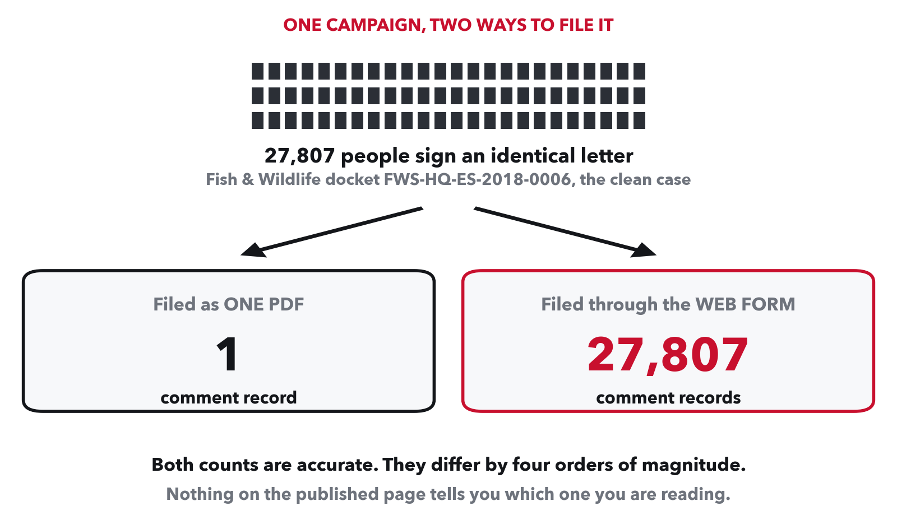
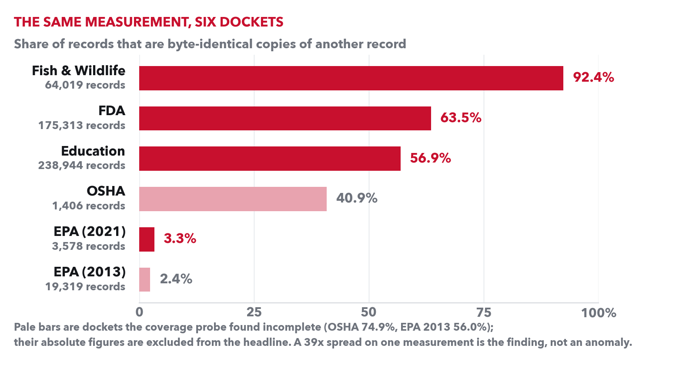

# What does a public comment count measure?

**On four federal dockets, 306,854 of 479,311 comment records are redundant copies of another
record's exact text, and every one is published as a separate comment.**



## The short version

US agencies must take public comments on proposed rules, and the count becomes evidence:
cited in press coverage and in litigation over whether an agency considered the public.

regulations.gov publishes a `duplicateComments` field. It is **not** a deduplication pass: on
every docket that populates it, **100% of records with a value above 1 carry an attachment**,
and their comment bodies read "See attached". It counts letters inside a bundled filing.

So a campaign of 27,807 people produces **one** record if the organiser files a single PDF,
and **27,807** records if the same people use a web form. Both counts are accurate. They
differ by four orders of magnitude. Nothing on the page says which you are reading.

Fish & Wildlife docket FWS-HQ-ES-2018-0006 is the clean case: **27,807 byte-identical
letters, filed individually, published as 27,807 comments.**

## The spread is the finding



One measurement, applied identically to six dockets, ranges from **2.4% to 92.4%**. That
39x spread is not noise and it is not a difference in how strongly the public feels. It
tracks how the comments arrived. A count that moves by 39x on filing mechanics is not
measuring public input, which is the thing it is cited as measuring.

## Scale

Six dockets, five agencies, **501,166 comment records**, 5.67M submissions. Coverage verified
against regulations.gov before any analysis: a keyless probe predicted the corpus size to
within **3 records in 518,260**.

## Built with

Python, S3, Terraform, AWS Bedrock (Titan embeddings), scikit-learn. 24 modules,
2,600 lines of source, 105 tests.

- MinHash/LSH and complete-linkage clustering implemented directly, at 500k-document scale
- Similarity blocks streamed into union-find rather than materialised: the FDA docket
  traverses **907,068,421 edges** (committed in `out/final-FDA-2021-N-1349.json`), after five
  distinct memory failures that were invisible at 3,000 documents and fatal at 238,944
- Infrastructure in Terraform as a destroyable unit, with a Bedrock role carrying
  `SourceAccount`/`SourceArn` conditions against the confused-deputy problem
- Corpus priced before committing to it: **$7.60 measured against a $265 naive extrapolation**
  ([`docs/aws_setup.md`](docs/aws_setup.md))
- Thresholds selected from **blind human labels**, not chosen for tidiness
- A controlled two-arm Bedrock experiment that **overturned one of the project's own findings**

Figures above are regenerated from the committed results by
[`docs/figures/make_figures.py`](docs/figures/make_figures.py), so they cannot drift from
the numbers they illustrate.

## Honest notes

This report includes the measurement errors made along the way, because several of them
pointed toward flattering the project's own thesis and were caught only by reading the
underlying text. Among them: a `or 1` fallback that silently rewrote an unpopulated field to
1 and manufactured an agency-behaviour claim that had to be retracted; an LLM judge arm that
was measured against human labels, failed at **kappa −0.279**, and was dropped rather than
shipped.

Claims are not all equally strong, and each is labelled with its own confidence level, its
evidence base and what would falsify it: **[docs/FINDING.md](docs/FINDING.md)**.

## Data

The public `s3://mirrulations` mirror of regulations.gov, maintained by Moravian University.

> mirrulations was accessed on 2026-09-21 from https://registry.opendata.aws/mirrulations.

Public Domain Mark 1.0. Final rules from the Federal Register API.

## Running it

```bash
python3 -m venv .venv && .venv/bin/pip install -r requirements.txt
PYTHONPATH=src .venv/bin/python src/fetch_docket.py EPA-HQ-OAR-2021-0317
PYTHONPATH=src .venv/bin/python src/run_docket.py  EPA-HQ-OAR-2021-0317
.venv/bin/python -m pytest tests/ -q
```

Per-docket results for all six are committed under `out/final-*.json`, so every number above
is checkable without re-running the pipeline.

## What this does not do

Measures distinctness, not authenticity. A deduplicated count counts arguments, not people.
Organised participation is participation. Six dockets chosen, not sampled; two are partial
and labelled as such.
